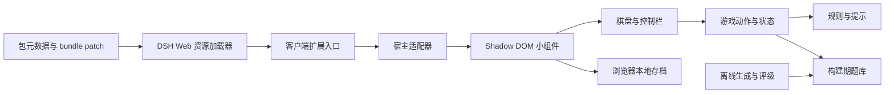

# dsh-sudoku-mini 代码构建规划

日期：2026-09-15

阶段：本文保留开发前规划；已按此方案完成首版代码构建，实际交付与验收边界见 [验证记录](./validation.md)。下文中的“当前”“拟”“尚未”均描述规划时的状态，不代表实施后的项目状态。

目标：在 DeepSeek Harness（dsh）Web 页提供一个悬浮入口，点击展开简洁、小巧的数独界面，让用户在 agent 工作期间游玩。

## 1. 项目现状与设计结论

当前项目是 npm/ESM 包骨架：`src/`、`docs/` 原本为空；已声明 `@deepseek-ai/cordis ^4.0.2`、`tsdown ^0.23.0`、`typescript ^7.0.2`，锁文件与 `node_modules` 已存在。当前 `main: index.js` 尚无对应入口，`test` 是默认失败占位脚本。检查环境中的 Node.js 为 `v24.18.0`，未发现可直接调用的 `dsh` 命令。现有文件保留到实施阶段再按计划修改。

采用 **dsh Web 扩展适配器 + Shadow DOM 内的原生 TypeScript 小组件 + 本地游戏状态 + 构建期题库**。由包元数据和宿主加载器发现浏览器资源，服务端插件保持为空的接入壳；不向 agent 注册游戏工具、不改会话数据、不触发模型请求。面板采用非模态交互；默认收起，用户随时可以回到 dsh 操作。

“不能影响 agent 正常工作”落实为以下边界，而非声称浏览器开销绝对为零：不更改 agent 运行链路；不截获面板外的输入；不覆盖关键审批操作；关闭后无游戏计时器和持续后台计算；流式输出过程中仍能正常输入、发送、停止与审批。完整验收见第 10 节。

DSH 官方仓库明确其仍处于开发者预览期，因此兼容范围须针对实际使用版本验证，不能仅凭 Cordis 依赖宣称支持所有 DSH 版本。[官方 README](https://github.com/deepseek-ai/deepseek-harness#developer-preview)

## 2. 首版功能范围

参考页能确认经典数独、难度切换、计时、错误计数、撤销、擦除、笔记、提示及新游戏等交互。这里只参考玩法与操作，不复制网站页面、素材或题目。[Sudoku.com 专家页](https://sudoku.com/zh/zhuanjia/)

| 功能 | 首版设计 | 验收要点 |
| --- | --- | --- |
| 悬浮入口 | 40 × 40 CSS px 数独图标按钮；点击展开/收起 | 初始无棋盘，无自动抢焦点 |
| 游戏窗口 | 右侧小型非模态面板，保留宿主可交互区域 | 无整页遮罩，不锁宿主滚动 |
| 经典棋盘 | 9 × 9，3 × 3 宫分隔，固定题面不可编辑 | 行、列、宫规则正确 |
| 难度 | 简单、中等、困难、专家；默认专家 | 每档题库具有可追溯评级 |
| 数字输入 | 点击格子后使用 1–9 数字栏或键盘 | 不向 dsh 输入框填入数字 |
| 笔记 | 单格 1–9 候选数切换；3 × 3 小字布局 | 与正式数字互斥，可撤销 |
| 辅助高亮 | 当前格、同行/列/宫、同数字、冲突格 | 固定数与玩家数有视觉区别 |
| 擦除与撤销 | 擦除正式值/笔记；单步撤销复合修改 | 恢复关联笔记，固定格不受影响 |
| 错误反馈 | 行/列/宫重复实时标红；可开启答案校验 | 默认不限错误次数、不强制失败 |
| 提示 | 单候选、隐藏单候选解释；无法推导时可明确选择揭示一格 | 不将答案揭示描述为逻辑推导 |
| 新游戏/重开 | 新题与重开当前题分开；有进度时面板内二次确认 | 换难度不会静默丢弃旧局 |
| 计时/暂停 | 面板可见且页面可见时计时；关闭、切后台、手动暂停时冻结 | 重开清零，暂停遮蔽棋盘 |
| 完成反馈 | 全盘填写并满足规则后出现简短完成卡片 | 仅填满但有冲突不算成功 |
| 自动保存 | 本地保存当前局、偏好与窗口位置 | 刷新后继续；存储失效仍可玩 |
| 入口避让 | 桌面可拖动入口和面板；位置限定于视口 | 拖动不误触开关，不覆盖宿主弹窗 |
| 无障碍 | 中文按钮标签、键盘导航、可见焦点 | 无键盘焦点陷阱 |

首版不安排账户、云同步、广告、每日挑战、排行榜、多人模式、杀手数独、完整高级解题教学及浏览器内实时挖空生成。后续如扩展高级提示或统计，以独立版本实现。

## 3. DSH 接入与兼容策略

实际接口、源码证据与版本信息汇总在 [DSH 插件接入调研](./dsh-plugin-research.md)。研究基线为官方 commit `c291e7961a515f6d7af9304e7fd1d257929aef26`，对应源码 CLI 版本 `0.1.5-rc.2`；这是拟验证目标，不是用户已安装版本或“最新版本”的声明。下列接入步骤必须先在固定版本的 DSH 上跑通，再展开游戏开发。

1. 使用 `dsh.bundle: { patch: './cordis.patch.yml' }`，由 patch 挂载本包的空 Cordis 服务端入口，让 profile 扫描到本包。
2. 声明 `dsh.client.platform: 'web'`、客户端包依赖 `dsh.client.inject` 及 `exports['./client']`；由宿主读取元数据并提供资源。不自建静态服务或游戏 API。
3. 浏览器插件导出 `inject = ['slots', 'layout']` 和 `apply(ctx)`；服务注入与第 2 步的包依赖声明是不同概念。通过 `ctx.slots.register({ name: 'shell.overlay', id: 'dsh-sudoku-mini' }, SudokuOverlay)` 注册。
4. `SudokuOverlay` 使用宿主共享 React 的 `useRef`/`useEffect` 创建 Shadow DOM 小组件挂载点；effect 返回 `destroy()`，slot 登记的 disposer 交给 Cordis effect。无需额外 ReactDOM 根。
5. 首选 `shell.overlay`，它是 `kind: 'list'`、`scope: 'root'` 的全局增量槽位，位于列滚动容器之外；保留宿主的点击穿透，仅入口与面板开启 pointer events。通过对 layout 的注入确保槽位声明已就绪。[官方布局源码](https://github.com/deepseek-ai/deepseek-harness/blob/c291e7961a515f6d7af9304e7fd1d257929aef26/packages/client/ui-layout/src/client/index.ts)
6. 客户端按宿主 closure-factory 协议输出 CJS，再包装为 `window.__ModuleLoader__.load({ id, factory })`；factory 内的 `require` 由宿主共享模块表解析。模块 id 为包名 `dsh-sudoku-mini`，不是 `dsh-sudoku-mini/client`。普通浏览器 ESM 或仅有 IIFE 均不足以满足协议，详细构建步骤见调研文档。
7. 固定实施时使用的 DSH 版本与上游 commit，记录资源地址、shared 模块名与实际加载结果；若用户版本没有这个槽位，先调整接入适配层，不以修改宿主源码或扫描 DOM 重挂载作为正式方案。

首次试接入仅显示按钮和空面板，验证资源可加载、一个入口、多次开关以及禁用后清理。不得把“模块能打包”当作“插件已成功接入”。本项目是 DSH 插件，不需要 Codex 的 `.codex-plugin/plugin.json`。

## 4. UI 布局与交互规格

### 4.1 尺寸、位置与视觉

- 桌面面板宽度目标 340 px，最大宽度 `min(340px, calc(100vw - 24px))`；棋盘边长约 306 px。常规高度目标约 470–520 px，最大高度 `calc(100dvh - 24px)`，内容超出时只滚动面板内部。
- 桌面入口默认靠右、距底部约 96 px，避开最底部输入操作区；面板展开时与入口相邻，最终默认位置在目标 DSH 布局中校准。
- 移动端 360 px 视口使用约 336 px 面板；加入 `safe-area-inset-*`。窄屏或虚拟键盘出现时收缩高度并保留关闭入口，不强制切换到全屏。小棋盘单格约 32–34 px，数字栏和工具按钮触控区域尽量达到 40–44 px。
- 白/深灰背景、一种蓝色强调色、浅色网格；固定数加粗，玩家数使用强调色，错误同时使用边框/标记，避免仅靠颜色区分。
- 使用系统字体及本地 SVG 图标，不引入远程字体、图片或大型 UI 库；支持浅色和深色主题，遵循 `prefers-reduced-motion`。
- 主题优先读取宿主公开主题接口；缺少接口时使用系统配色和面板内偏好。不要为主题同步监听整页 DOM。
- 层级必须在目标 DSH 的弹窗/审批界面之下；不使用极大 `z-index` 争夺顶层。固定定位挂载点应避开被祖先 `transform` 或裁剪影响的容器，第一阶段验证必要时使用适配器拥有的 portal。

```text
┌────────────────────────────┐
│ 数独    专家 ▾    暂停  ×  │
│ 08:42          已填 24/58  │
│ ┌────────────────────────┐ │
│ │                        │ │
│ │       9 × 9 棋盘        │ │
│ │                        │ │
│ └────────────────────────┘ │
│ 1  2  3  4  5  6  7  8  9 │
│ 撤销   擦除   笔记   提示   │
│ 新游戏               更多 ⋯│
└────────────────────────────┘
                       [数独]
```

图中布局用于明确密度，不是最终像素稿。“更多”收纳重开、答案校验、自动清理笔记和设置；完成/换局确认在面板内展示，不弹整页对话框。

### 4.2 键盘与焦点

| 输入 | 作用域 | 行为 |
| --- | --- | --- |
| 1–9 / 小键盘数字 | 棋盘聚焦时 | 输入正式值或切换笔记 |
| 方向键 | 棋盘聚焦时 | 移动选择，越界停在边缘 |
| Backspace / Delete | 棋盘聚焦时 | 擦除可编辑格 |
| N | 棋盘聚焦且无组合键时 | 切换笔记 |
| Ctrl/Cmd + Z | 棋盘聚焦时 | 游戏撤销 |
| Escape | 焦点在面板内时 | 优先退出内部确认，再收起面板 |
| Tab / Shift + Tab | 面板及宿主 | 按正常顺序移动，可离开面板 |

键盘监听绑定在游戏根节点，不在 `window`/`document` 注册全局游戏快捷键；使用 `composedPath()` 和 ShadowRoot 内焦点确认事件来源。仅对已处理的游戏按键调用 `preventDefault()`，必要时停止冒泡；保留输入法组合事件、下拉选择以及文本输入的默认行为。[MDN：事件路径](https://developer.mozilla.org/en-US/docs/Web/API/Event/composedPath)

Shadow DOM 不能阻止宿主捕获阶段监听器先收到事件；第一阶段必须测试 DSH 是否存在冲突。若存在，优先使用宿主支持的快捷键作用域接口；仍无法解决时采用独立 iframe 游戏文档，并重新核对资源路由、焦点、通信和性能，不用全局阻断键盘事件。

按钮展开后聚焦棋盘的选中格；关闭时仅当焦点仍在游戏内才归还入口。若用户已经点击宿主输入框，不重新抢焦点。棋盘使用 `role="grid"`、行/单元格语义及单个 roving tabindex，避免 Tab 依次遍历 81 格；提示/完成信息用低频 `aria-live` 宣告，计时器不逐秒宣告。

### 4.3 拖动与点击

使用 Pointer Events，仅入口和标题栏拖动；移动超过约 6 px 才进入拖动状态，结束后抑制该次点击。拖动期间更新 CSS 位置，松手后才存储。保存归一化位置，视口变化后重新夹紧；桌面可拖动面板，移动端以角落吸附位置为主。用户打开宿主弹窗后，面板不遮挡其按钮且不保留焦点捕获。

## 5. 模块划分与拟建目录

```text
dsh-sudoku-mini/
├── docs/
│   ├── implementation-plan.md
│   ├── dsh-plugin-research.md
│   └── compatibility.md          # 实施后填写实测版本
├── src/
│   ├── index.ts                  # Cordis 服务端入口
│   ├── client/
│   │   ├── index.ts              # 宿主协议、扩展登记
│   │   ├── host-adapter.tsx       # 复用宿主 React 的薄适配器
│   │   ├── widget.ts             # ShadowRoot 创建/销毁
│   │   ├── panel.ts              # 展开、焦点、内部确认
│   │   ├── board.ts              # 棋盘和候选数渲染
│   │   ├── controls.ts           # 数字栏、工具栏
│   │   ├── keyboard.ts           # 局部快捷键
│   │   ├── positioning.ts        # 拖动、夹紧、视口适配
│   │   ├── clock.ts              # 计时与暂停原因
│   │   ├── storage.ts            # 存档与格式校验
│   │   └── styles.ts             # 小组件内部 CSS 文本
│   ├── game/
│   │   ├── types.ts              # 题面、局面、动作
│   │   ├── rules.ts              # peers、候选、冲突、完成
│   │   ├── reducer.ts            # 唯一游戏状态修改入口
│   │   ├── history.ts            # 复合动作差量与撤销
│   │   ├── hints.ts              # 初级逻辑提示、答案揭示
│   │   └── puzzles.ts            # 选题与保规则变换
│   └── data/
│       └── puzzles.json          # 固定题库和评级元数据
├── scripts/
│   ├── generate-puzzles.ts       # 离线生成；不进入浏览器产物
│   ├── validate-puzzles.ts       # 解数计数、评级和重复检查
│   └── check-artifacts.ts        # 包元数据、入口及资源一致性
├── tests/
│   ├── game.test.ts
│   ├── puzzles.test.ts
│   ├── storage.test.ts
│   ├── widget.test.ts
│   └── e2e/                     # 小组件 fixture + 真实 dsh 场景
├── tsconfig.json
├── tsconfig.server.json
├── tsconfig.client.json
├── tsdown.config.ts
├── cordis.patch.yml              # bundle 层挂载本包接入壳
├── vitest.config.ts
├── playwright.config.ts
├── package.json
├── pnpm-lock.yaml
└── README.md
```

文件列表是职责边界；如果模块很短且没有独立行为，实施时允许合并。游戏规则不依赖 DOM、Cordis 或 React，服务端不导入浏览器模块，离线求解器不进入客户端依赖图。



拟定三个核心边界：`createWidget(container, options) -> { destroy() }`，`reduceGame(state, action) -> { state, change }`，`load/save(snapshot) -> result`。规则计算为纯函数；计时、存储与 DOM 操作在小组件层执行。局部 store 足够，不引入 Redux 等状态库。

## 6. 游戏数据与动作语义

### 6.1 数据结构

```ts
type Digit = 0 | 1 | 2 | 3 | 4 | 5 | 6 | 7 | 8 | 9;
type Difficulty = 'easy' | 'medium' | 'hard' | 'expert';

interface Puzzle {
  id: string;
  difficulty: Difficulty;
  givens: string;       // 81 字符，0 表示空格
  solution: string;     // 经唯一解校验的 81 字符答案
  ratingVersion: string;
  ratingScore: number;
  hardestTechnique: string;
}

interface GameState {
  puzzleId: string;
  transformSeed: number;
  values: Digit[];       // 长度 81，包括不可修改的固定数
  notes: number[];       // 长度 81；低 9 位表示候选数
  selectedCell: number | null;
  noteMode: boolean;
  status: 'playing' | 'won';
  elapsedMs: number;
  hintCount: number;
}
```

运行时同时持有变换后的题面/答案、撤销历史与设置；存档通过题目 ID、题库版本和变换种子重建题面。数组长度、值域、不可修改格等必须在存档载入时验证，TypeScript 类型不能替代运行时验证。暂停原因另存于 UI 控制器，区分手动暂停、面板收起与页面隐藏，避免相互覆盖。

### 6.2 动作与撤销

- 动作包括 `select`、`enterDigit`、`toggleNote`、`erase`、`undo`、`applyHint`、`newGame`、`restart`；统一通过 reducer 更新。
- 固定格可选择用于高亮，但填数、擦除、笔记动作无效；对无实际变化的操作不新增历史。
- 正式填数清空当前格笔记；开启“自动清理笔记”时同步清除 peers 中对应候选，所有变更记为一个撤销动作。
- 笔记模式下允许切换用户候选；在已有玩家数字的格子添加笔记时，将正式值清除并作为同一个可撤销动作，固定格除外。
- 历史使用差量，包含修改前后的值与笔记；上限目标 200 个动作。撤销不倒退真实游玩时间，也不减少累计提示次数。
- 首版错误默认采用规则冲突提示；可选答案校验显示与唯一答案不符的玩家值，但不设置三次错误失败。冲突与答案错误派生计算，不保留容易失真的独立错误标记状态。
- 提示先检查玩家值与答案是否相容；存在错误时指明需检查的格子，不基于错误局面推导。单候选/隐藏单候选仅预览说明，用户确认才填数；答案揭示单独明确标识。
- 提示填入值仍可撤销，累计提示次数不回退。棋盘填满后验证全部行、列、宫；成功冻结计时。若撤销最后一步，恢复进行状态。
- 新游戏或重开有进度时展示内部确认；取消保持当前题、计时、难度与选择不变。新游戏跳过最近使用的题目，在候选耗尽时允许循环。

## 7. 题库、难度与性能取舍

首版采用离线生成的内置题库，运行时只选题并做合法变换。集成初期每档至少 5 道经过验证的题目，首版发布目标每档至少 20 道；题库体积计入浏览器资源预算。优先自己离线生成，若采用外部题库需附原始来源和许可证，不能直接抓取参考网站题面。

1. 构建脚本生成完整有效棋盘，再挖空并用解数计数器验证；找到第二个解即终止，只有解数等于 1 的题目进入题库。
2. 唯一解求解器使用 bitmask 与最少候选优先回溯，仅供构建/测试使用；设置每题耗时和总尝试上限，超限跳过并报告，避免构建无限等待。
3. 难度由版本化的逻辑求解过程评级，不能仅按提示数或空格数分类：简单以裸单数/隐藏单数为主；中等增加锁定候选；困难增加裸对/隐藏对；专家候选需高级消除策略（例如 X-Wing），并通过具体策略轨迹和人工抽查确认。
4. 评级器不支持或无法完成逻辑求解的题目标为“未评级”并不纳入四档发布题库，不把回溯次数直接冒充人类难度。不声称其“专家”与 Sudoku.com 官方评级完全一致。
5. 若专家题数量不足，优先补足离线评级/题源，而不是降低分类标准。高级评级属于发布所需工作；高级交互提示属于后续工作，两者不混淆。
6. 运行时可进行数字双射、同一宫带内行交换、同一宫栈内列交换、整宫带/栈交换以及转置；题面与答案同步变换，保持规则和唯一解。变换提供外观变化，不作为新增独立题目的数量。
7. 对变换加入种子并存档；变换序列和算法版本固定，确保刷新后棋盘一致。题库 ID 稳定，升级时保留兼容题目或提供旧存档迁移。

运行时规则计算预计算 81 格的 peers，每次修改只重算必要高亮/冲突；棋盘初次创建后复用节点，计时更新仅修改文本。首版不需要 Worker，因为在线阶段没有昂贵生成；未来引入生成时再增加可终止的 Worker 和取消协议。

## 8. 隔离、存储与资源生命周期

### 8.1 宿主隔离

使用 `attachShadow({ mode: 'open' })`，所有 CSS 位于 ShadowRoot 内。明确设置字体、颜色、行高、盒模型等继承属性，只有宿主适配器的位置样式位于外层。Shadow DOM 隔离样式选择器，仍允许继承属性/CSS 变量传入，且并非安全沙箱。[MDN：Shadow DOM](https://developer.mozilla.org/en-US/docs/Web/API/Web_components/Using_shadow_DOM)

不修改 dsh 的 `body`、根容器、全局样式、`fetch`、WebSocket、History API 或会话 store；不订阅 token 流来刷新棋盘；不读取凭证、对话正文或工作区文件。入口和面板之外不得放置可拦截点击的透明全屏层。若使用覆盖视口的定位容器，该容器须 `pointer-events: none`，只有入口/面板恢复为 `auto`。

### 8.2 存档策略

- key 采用版本化命名空间，如 `dsh-sudoku-mini:v1:game` 与 `dsh-sudoku-mini:v1:settings`。默认作用域为当前浏览器 origin，跨 DSH 会话保留同一局，不假定拥有工作区 ID。
- 存档含 schema 版本、题库/变换版本、题目 ID、种子、当前值/笔记、累计时间、提示次数、设置以及有限历史；不保存宿主内容。大小上限目标 64 KB。
- 游戏修改后约 250–500 ms 防抖保存；收起、`visibilitychange` 隐藏以及可用的页面离开事件立即尝试落盘；不依赖离页事件作为唯一保存机会。计时不用逐秒写入存储，可每 15 秒低频检查点。
- `localStorage` 访问与写入使用 `try/catch`，处理被禁止访问、配额不足、损坏 JSON、未知版本和失效题目，失效时提供“无法恢复上一局，开始新游戏”的短提示，不向宿主抛异常。该 API 按 origin 存储且可能访问失败。[MDN：localStorage](https://developer.mozilla.org/en-US/docs/Web/API/Window/localStorage)
- 首版多标签页分别使用各自内存状态，不实时同步；存档按最近成功保存的快照恢复，文档明确“最后保存覆盖”。每个标签页保留 `tabId`/修订号用于识别外部修改，游戏中不自动换盘。

### 8.3 清理与计时

| 生命周期 | 需要执行的动作 |
| --- | --- |
| 宿主挂载 | 创建唯一入口与容器；不自动开始计时 |
| 第一次打开 | 校验/恢复存档或选新题；创建棋盘与局部监听 |
| 打开且页面可见 | 若未手动暂停/完成，每秒更新计时文本 |
| 面板关闭或页面隐藏 | 结算当前计时片段、停计时器、刷新存档 |
| 返回前台/重开面板 | 只解除对应自动暂停原因，不解除手动暂停 |
| 视口变化 | 按需调整位置，短帧节流，不建立持续动画循环 |
| 禁用/卸载 | 刷新存档，清理 timers、raf、监听、订阅、指针捕获与自有 DOM |

运行中的片段用 `performance.now()` 计算累计时长，不假定 interval 准时触发。页面可见性依靠 `visibilitychange`，浏览器后台节流不会被错误累计为有效游玩时间。[MDN：页面可见性事件](https://developer.mozilla.org/en-US/docs/Web/API/Document/visibilitychange_event)

服务端包发现与客户端 slot 登记分别遵循宿主插件生命周期；游戏 `destroy()` 幂等。延迟任务和异步资源回调在卸载后不得重新创建 DOM。

## 9. 构建、包元数据与开发顺序

### 9.1 构建配置

- 继续使用 pnpm、TypeScript 和 tsdown；打开 `strict`，服务端与客户端使用不同 `lib`/模块配置，避免客户端意外引入 Node API。
- 服务端产物为 ESM（拟 `lib/index.js` 和 `lib/types/index.d.ts`）；客户端为闭包包裹的 CJS（拟 `lib/client.js` 和 `lib/types/client/index.d.ts`），与调研中的 manifest 草图统一。构建包装 id 使用包名 `dsh-sudoku-mini`。
- 客户端显式 external 宿主共享 React；薄适配器可用 classic React JSX 转换减少依赖请求。研究基线也共享 `react/jsx-runtime`，因此自动 JSX 转换可行，但升级时须再次核对共享表。Cordis、slots、layout 的类型导入只用于编译，不引入宿主私有实现。依赖版本和 peerDependencies 范围在第一阶段实测后确定。
- 样式以字符串注入 ShadowRoot，避免 CSS 提取后污染宿主；首版使用单个小型客户端产物，不预设浏览器支持多 chunk 动态加载。题库暂时随游戏代码打包，棋盘 DOM 和状态仍首次打开才初始化。
- 构建脚本之间不能相互清空输出目录；服务端/客户端分别输出到独立目录或只在整体构建前清理一次。
- `package.json` 调整 `main`/`exports`/`types`/`files`、`dsh.bundle` 与 `dsh.client`，将默认失败的 `test` 替换为有效检查。导出 `. / ./client / ./package.json`；不添加不存在的 `dsh.client.entry` 字段，也不使用 `browser` 字段代替客户端导出。`files` 纳入运行时产物、`cordis.patch.yml`、README 和必要许可证，排除测试/离线生成器。
- sourcemap 仅本地调试使用，生产产物压缩；保持题库生成可复现。`pnpm-lock.yaml` 只在实施时增加实际使用的依赖。

拟建立命令：

```sh
pnpm typecheck           # 服务端与浏览器类型检查
pnpm puzzles:validate    # 题库唯一解、评级和结构检查
pnpm test                # 有意义的规则/存档/交互测试
pnpm build               # 服务端和客户端构建
pnpm check:artifacts     # manifest、输出路径、宿主依赖检查
pnpm test:e2e            # 浏览器交互检查
pnpm pack               # 生成可安装的发布包
```

这些脚本目前不存在。安装命令、profile 配置与启停行为以调研结果和固定版本 CLI 的实际输出为准，实施阶段先在独立测试 profile 验证，避免对用户正在工作的 agent 实例做安装/重启实验。

### 9.2 分阶段交付

| 阶段 | 具体工作 | 交付物 | 通过条件 | 估算 |
| --- | --- | --- | --- | --- |
| P0：接入验证 | 固定 DSH 版本；验证 bundle、资源加载、全局 slot、React 共享和卸载 | 最小按钮/空面板；兼容记录 | 无宿主源码修改；真实 DSH 上可显示/禁用且输入无冲突 | 0.5–1 天 |
| P1：规则与题库 | peers、候选、唯一解验证、离线评级；先准备每档 5 题 | 纯函数游戏模块与初始题库 | 固定格保护、冲突/完成与题库校验通过 | 1–2 天 |
| P2：紧凑 UI | ShadowRoot、棋盘、数字栏、选择高亮、焦点与局部键盘 | 可完成一局的小面板 | 鼠标与键盘均可玩，宿主可正常操作 | 1–1.5 天 |
| P3：完整玩法 | 笔记、复合撤销、擦除、提示、换局确认、计时/暂停、存档 | 首版功能齐全 | 关闭/刷新续玩正确，损坏存档可恢复 | 1–1.5 天 |
| P4：兼容与发布 | 拖动/移动端/主题；补足每档 20 题；真实 agent 场景回归；产物打包 | 发布包、README、兼容矩阵 | 第 10 节验收达标，本地安装成功 | 1–2 天 |

总估算约 5–8 人日，主要不确定性是 DSH 扩展接口变化与专家题评级。阶段按依赖顺序推进；P0 未通过时不扩大业务代码投入。以上是规划估算，不代表已完成开发或保证具体上线日期。

## 10. 验证与验收清单

### 10.1 自动检查

只针对真正可能出错的行为编写测试，不做无意义的逐函数覆盖或大面积样式快照。

- **规则测试**：边缘/中心格 peers、固定格保护、行列宫重复、满盘冲突不完成、正确完成后撤销恢复。
- **复合动作测试**：正式值与笔记互斥、peer 笔记自动清理后单次撤销恢复所有格、无效动作不消耗历史、提示撤销与次数语义。
- **题库测试**：每题结构/值域/答案与 givens 相容、答案有效、唯一解、数量和评级元数据；测试所有合法变换保持有效及种子重建一致。
- **存档测试**：损坏/未知 schema、无效题目、错误数组长度、固定格篡改、存储访问失败、配额错误、升级后的题库/变换兼容。
- **生命周期测试**：挂载/卸载重挂载不重复入口；关闭时 timers 归零；销毁后延迟任务不重建；隐藏与手动暂停组合正确。
- **浏览器测试**：点击/键盘填数、换局取消、刷新恢复、焦点返回、拖动不误开关、Tab 可离开、面板外键盘默认行为。
- **产物检查**：bundle 指向存在的文件、资源地址匹配、`pnpm pack` 包含客户端、无意外 Node API 或重复宿主 React/Cordis、离线求解器未进入浏览器包。

普通 UI fixture 只能覆盖小组件；DSH 的 slot、资源路由、快捷键捕获、审批层级与真实流式响应必须在目标 DSH 上验证。端到端测试可使用固定响应/本地测试模型做可重复回归，发布前再做一次真实 agent 冒烟验证。

### 10.2 “不影响 agent”必须通过的实际场景

1. 面板收起时，在 dsh 输入框中输入数字、方向键、Delete、撤销等，行为与未安装插件一致。
2. 面板展开但焦点在 dsh 输入框时，宿主仍正确处理上述键；在棋盘内操作也不会误发送消息或触发宿主命令。
3. agent 流式回复/执行工具时，连续填数与撤销，输出继续；发送、停止、切换会话和新建会话仍正常。
4. 宿主权限审批、设置弹窗和错误提示可见可点；游戏面板不能遮住关键按钮或夺取弹窗焦点。
5. 多次切换会话、刷新、关闭和禁用后，入口没有重复，游戏状态遵循存档规则，无未捕获异常或泄漏计时器。
6. 页面空白区域与聊天列表仍可点击/滚动；收起面板不造成宿主布局移动，不阻止 agent 完成。

### 10.3 性能与视口目标

以下为实施后测量目标，尚无测量结果；采用同一机器/浏览器，以未安装插件为基线比较。

| 指标 | 首版目标 | 测量办法 |
| --- | --- | --- |
| 新增客户端资源 | JS + CSS + 题库 gzip ≤ 60 KB；不含宿主共享 React | 检查实际网络资源与压缩尺寸 |
| 打开面板耗时 | 缓存资源后点击到可交互，桌面 p95 ≤ 100 ms | 浏览器性能标记，多次采样 |
| 单次填数响应 | 桌面 p95 ≤ 16 ms；中档移动设备 ≤ 32 ms | 动作到渲染采样 |
| 隐藏状态 | 无游戏 interval、持续 raf、题目生成和网络轮询 | DevTools、计时器/监听计数 |
| 主线程长任务 | 插件初始化/游戏操作不产生 ≥ 50 ms 长任务 | Performance trace |
| 泄漏检查 | 开关 50 次、挂载/卸载 10 次，无持续增长的自有 DOM/监听/timer | 资源计数及内存快照 |
| 常规视口 | 1440 × 900、1280 × 720、360 × 800 可玩且可关闭 | Playwright + 手动触控检查 |
| 缩放/短屏 | 200% 缩放、360 × 640、虚拟键盘出现时控制项可达 | 内部滚动与焦点检查 |

性能目标不达标时先定位依赖体积、首次初始化、整盘重渲染或存储频率；调整后重测，不以主观“看起来不卡”替代证据。

## 11. 已知风险及应对

| 风险 | 应对与决策点 |
| --- | --- |
| 用户实际 DSH 版本未知 | P0 固定并记录实测版本；研究基线不等同于兼容声明 |
| Web 扩展点或模块协议变化 | 所有宿主接口集中到服务端/客户端适配器；升级复测 |
| Shadow DOM 内事件仍被宿主捕获 | P0 验证快捷键作用域；必要时评估独立 iframe，不全局抢事件 |
| 浮层被祖先裁剪、覆盖审批或其他插件入口 | 验证挂载/portal 与层级；允许移动和重置位置，必要时微调默认角落 |
| 专家难度分类不可靠 | 可复现策略评级、人工抽查和足够题库；未评级题不入库 |
| 本地存储禁用、损坏或升级失配 | 运行时校验、降级内存、题库 ID/变换版本迁移 |
| 原生 DOM 更新状态不一致 | 单一 reducer、派生状态与复用节点，复合动作测试 |
| pnpm 安装/打包与 DSH 加载差异 | 同时检查构建产物和打包后的本地安装，不仅源码链接 |
| 多标签页最后保存覆盖 | 首版明示作用域和覆盖规则，不自动同步换题 |

## 12. 开发完成的定义

发布前必须同时满足：固定版本 DSH 可安装加载；首版功能表完成；四档唯一解题库和评级达标；真实 agent 场景验证通过；键盘、焦点、审批层级与移动端可用；资源清理和性能指标有记录；README 给出安装、构建、操作、存档边界与已验证兼容版本。

规划阶段交付为本文和接入调研文档。实施结果见验证记录；未执行的真实模型任务、设备与性能验收仍列明为待验证项，不能据此宣称全部发布验收已完成。

## 13. 实施调整

- 游戏面板、棋盘、操作栏和定位逻辑合并在 `src/client/widget.ts` 的封装内，保持一个创建/销毁接口；规则、reducer、提示、题库、存档和计时仍独立。避免首版拆出大量互相引用的小文件。
- 最终题库为每档 20 题，共 80 题；专家采用可复现 X-Wing 评级，离线生成与求解代码不进入在线客户端。
- 固定 pnpm `11.25.0`，替代环境中依赖元数据缓存校验失败的 pnpm 12；Playwright 固定 `1.55.1` 以支持本环境 Ubuntu 20.04。
- 桌面 340 px 面板实测常规高度约 545 px，略高于最初高度目标；360 × 640 视口可用，设置展开后使用内部滚动。
- 兼容验证使用 `/tmp` 下的独立 DSH，未改动用户日常 profile。真实 API 凭证未配置，因此真实模型流式输出、工具执行和权限审批尚未验收；预览页的模拟输出/审批仅作为隔离回归。
